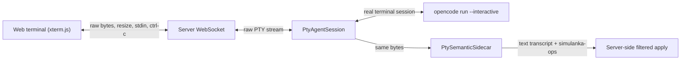

# Agent PTY Bridge

Date: 2026-06-12
Owner: Codex

This is the prototype for proposal 2: real-time agent interaction through a
PTY, with a semantic sidecar for Simulanka-specific structure.

## Shape

## Contract

- Raw terminal stream stays lossless enough for a browser terminal. The server
  should forward `PtyRead.data` to the UI.
- Semantic stream is derived, not authoritative. The server can store
  `PtyRead.semantic.text` as transcript text and inspect
  `PtyRead.semantic.ops`.
- The agent may emit fenced `simulanka-ops` JSON blocks. The sidecar extracts
  complete blocks even when they arrive split across multiple PTY reads.
- Parsed ops are still intents only. The server/kernel owns permission checks,
  graph lookup, and conversion to real kernel operations.

## Current Code

- `src/simulanka/agent/pty_bridge.py`
  - `PtyAgentSession`: starts a PTY-backed process, supports read/write,
    `send_line`, resize, interrupt, terminate.
  - `PtyAgentSession.opencode(...)`: builds an interactive opencode session.
  - `PtySemanticSidecar`: strips terminal control sequences, keeps a bounded
    transcript, and parses `simulanka-ops`.
- `tests/test_agent_pty_bridge.py`
  - Covers ANSI cleanup, split op-block extraction, op parse errors, and a real
    PTY input/output round trip.

## Next Integration Point

Claude-owned server/frontend can add two channels later:

- Terminal channel: raw bytes from `PtyRead.data`, plus stdin/resize/interrupt
  messages back to `PtyAgentSession`.
- Semantic channel: structured events from `PtyRead.semantic`, especially ops
  that should go through the existing `/edge` and verdict/discuss endpoints.
